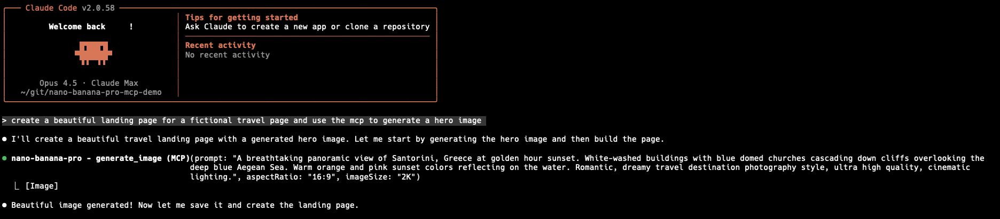

# nano-banana-pro-mcp

<p align="center">
  
</p>

MCP server that enables AI agents like Claude to generate images using Google's Gemini image generation models (including Nano Banana Pro - gemini-3-pro-image-preview).

## Example

Here's Claude Code using the MCP to generate a hero image for a travel landing page:



And the beautiful result:


---

## Installation

### Claude Code CLI

```bash
claude mcp add nano-banana-pro -- npx @rafarafarafa/nano-banana-pro-mcp
```

Then add your API key to the MCP config. Open `~/.claude.json` and find the `nano-banana-pro` server entry, then add your key:

```json
{
  "mcpServers": {
    "nano-banana-pro": {
      "type": "stdio",
      "command": "npx",
      "args": ["@rafarafarafa/nano-banana-pro-mcp"],
      "env": {
        "GEMINI_API_KEY": "your_api_key_here"
      }
    }
  }
}
```

> **Note**: Environment variables from your shell (like `export GEMINI_API_KEY=...`) are NOT passed to MCP servers. You must add the key directly in the JSON config.

### Claude Desktop

Add to your Claude Desktop configuration file:

**macOS**: `~/Library/Application Support/Claude/claude_desktop_config.json`
**Windows**: `%APPDATA%\Claude\claude_desktop_config.json`

```json
{
  "mcpServers": {
    "nano-banana-pro": {
      "command": "npx",
      "args": ["@rafarafarafa/nano-banana-pro-mcp"],
      "env": {
        "GEMINI_API_KEY": "your_api_key_here"
      }
    }
  }
}
```

### Codex CLI

Create or edit `.mcp.json` in your project directory (or `~/.mcp.json` for global config):

```json
{
  "mcpServers": {
    "nano-banana-pro": {
      "command": "npx",
      "args": ["@rafarafarafa/nano-banana-pro-mcp"],
      "env": {
        "GEMINI_API_KEY": "your_api_key_here"
      }
    }
  }
}
```

### Gemini CLI

Create or edit `~/.gemini/settings.json`:

```json
{
  "mcpServers": {
    "nano-banana-pro": {
      "command": "npx",
      "args": ["@rafarafarafa/nano-banana-pro-mcp"],
      "env": {
        "GEMINI_API_KEY": "your_api_key_here"
      }
    }
  }
}
```

---

## Get an API Key

Get a free Gemini API key from [Google AI Studio](https://aistudio.google.com/apikey).

---

## Available Tools

### generate_image

Generate an image from a text prompt.

**Parameters:**
- `prompt` (required): Description of the image to generate
- `model` (optional): Gemini model to use (default: `gemini-3-pro-image-preview`)
  - `gemini-3-pro-image-preview` - Nano Banana Pro (highest quality)
  - `gemini-2.5-flash-preview-05-20` - Nano Banana (fast)
  - `gemini-2.0-flash-exp` - Widely available fallback
- `aspectRatio` (optional): `"1:1"` | `"3:4"` | `"4:3"` | `"9:16"` | `"16:9"`
- `imageSize` (optional): `"1K"` | `"2K"` | `"4K"` (only for image-specific models)

**Example prompt:**
```
Generate an image of a sunset over mountains with dramatic orange and purple clouds
```

---

## Development

### Setup

```bash
npm install
npm run build
```

### Testing

```bash
npm test              # Run unit tests
npm run test:watch    # Run tests in watch mode
npm run typecheck     # Type check without emitting
```

### Manual Testing

```bash
# Generate a real image and save to test-output.png
GEMINI_API_KEY=your_key npm run test:manual "a cute cat wearing sunglasses"
```

### Testing with MCP Inspector

```bash
npx @modelcontextprotocol/inspector node dist/index.js
```

Then set `GEMINI_API_KEY` in the inspector's environment and call the `generate_image` tool.

---

## License

MIT
